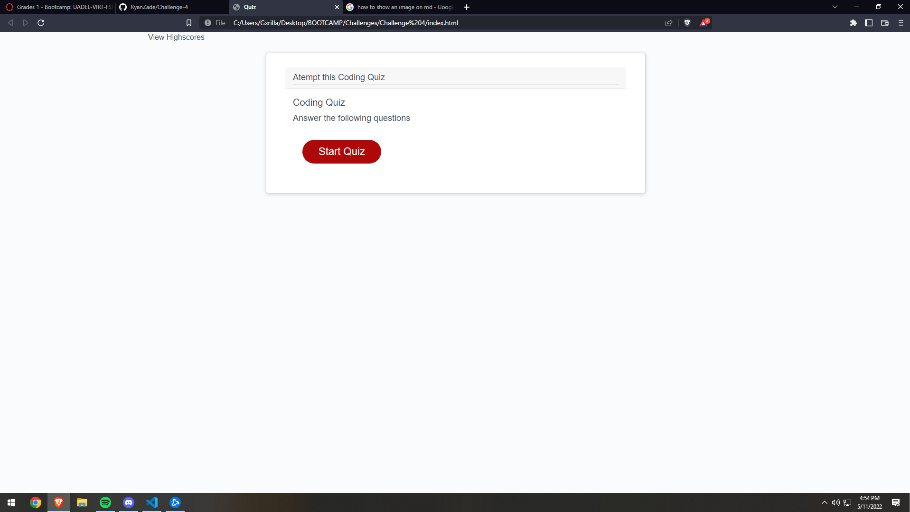

# Challange 4 Web-APIs
The challenge required students to modify starter code to create an application that enables employees to generate random passwords based on criteria that they’ve selected.

The HTML shows a starer page which required a click button which then promts the user to answer a series of questions and concludes with a score.
CSS files were used for site accessabilty and looks. JavaScript files were used to ensure the page ran correctly

  Contents:
    - HTML File
    - Assets Folder
      - Images
      - CSS
      - Java Script

The HTML file should be accessable from the https link: https://github.com/RyanZade/Challenge-4.git

RyanZade